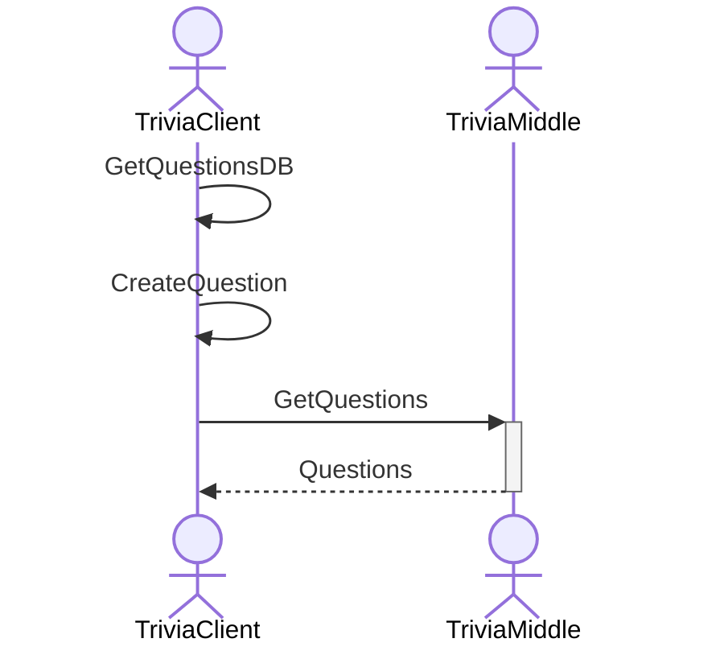
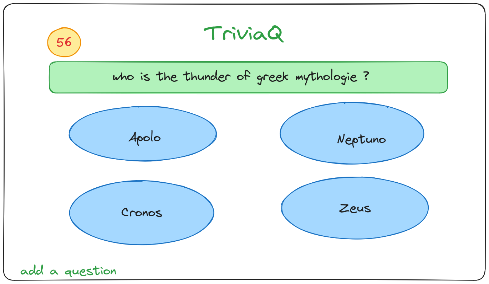
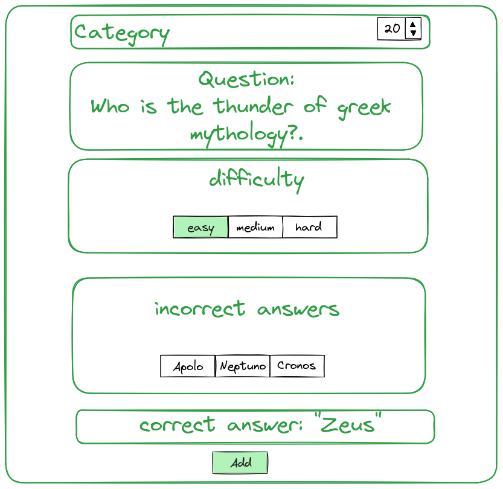

# Trivia Questions

-----
This repo contains the Trivia Questions API developed with Scala, Pekko and PekkoHTTP.

You can explore the API specification in the `openapi.yml` file.

### Setup and running

Before running the project you must provide in the `main/resources` folder the `application.conf` configuration file as
follows:
```text
trivia {
  external{
    # The external API URL
    api-url = "https://opentdb.com/api.php" 
  }
  routes {
    # The maximum timeout for requests
    ask-timeout = 10s
  }
  postgres {
    # Your postgreSQL configuration
    connectionPool = "HikariCP"
    dataSourceClass = "org.postgresql.ds.PGSimpleDataSource"
    properties = {
     serverName = "localhost"
     portNumber = "5432"
     databaseName = "trivia" # must be trivia
     user = "user" # your user
     password = "" # your pass
    }
    numThreads = 10
  }
}

```

Also, it's necessary to create a database called `trivia` in PostgreSQL with the table
`questions` following the structure:

```sql
CREATE TABLE questions (
    type VARCHAR(255),
    difficulty VARCHAR(255),
    category VARCHAR(255),
    question VARCHAR(255),
    correct_answer VARCHAR(255),
    incorrect_answers TEXT[]
);
```

Finally, you can run the app using `sbt` with :
```bash
sbt run 
```

### Description

Basically, the API allows to communicate with another API to get the questions based in the `/questions` endpoint,
and here we are using the fact that we have two actors in our system.

**Note**: When using the parameter `category` it is encoded as a number, here we list the possible values and its
meaning:

| Category                              | Number of Category |
|---------------------------------------|--------------------|
| General Knowledge                     | 9                  |
| Entertainment: Books                  | 10                 |
| Entertainment: Film                   | 11                 |
| Entertainment: Music                  | 12                 |
| Entertainment: Musicals & Theatres    | 13                 |
| Entertainment: Television             | 14                 |
| Entertainment: Video Games            | 15                 |
| Entertainment: Board Games            | 16                 |
| Science & Nature                      | 17                 |
| Science: Computers                    | 18                 |
| Science: Mathematics                  | 19                 |
| Mythology                             | 20                 |
| Sports                                | 21                 |
| Geography                             | 22                 |
| History                               | 23                 |
| Politics                              | 24                 |
| Art                                   | 25                 |
| Celebrities                           | 26                 |
| Animals                               | 27                 |
| Vehicles                              | 28                 |
| Entertainment: Comics                 | 29                 |
| Science: Gadgets                      | 30                 |
| Entertainment: Japanese Anime & Manga | 31                 |
| Entertainment: Cartoon & Animations   | 32                 |

On the other hand, we have "our service" side, where we can create and obtain our own questions using
the `/questions/db` endpoint.

In addition, here you can find the documentation of the API and the project including:

1. Sequence diagram of the actor system
2. CURL examples
3. Frontend design (sketch)

### Sequence diagram

We present the sequence diagram including the system's actors: `TriviaClient` and `TriviaMiddle`, 
the first two messages : `GetQuestionsDB` & `CreateQuestion` are the messages to use the database to create and get 
questions (we represent these messages as an own actor message), while the third message `GetQuestions` refer to communicate to actor `TriviaMiddle` who is in charge of getting
the questions from the external API, then the actor answer with `Questions` containing the result of the request to the
`TriviaClient` actor.


### CURL examples

1. Using the API `/questions` endpoint to get parametrized questions from another API:

```bash
curl --location --request GET 'http://localhost:3001/api/questions?amount=1&category=16&difficulty=easy&type=multiple'
```

2. Using the API `/questions/db` endpoint to create a question:

```bash
curl --location --request POST 'http://localhost:3001/api/questions/db' \
--header 'Content-Type: application/json' \
--data '{
            "category": "Mythology",
            "correct_answer": "Zeus",
            "difficulty": "easy",
            "incorrect_answers": [
                "Apolo",
                "Neptuno",
                "Cronos"
            ],
            "question": "Who is the thunder god in the greek mythology",
            "type": "multiple"
}'
```

3. Using the API `questions/db` endpoint to get questions from the database:

```bash
curl --location --request GET 'http://localhost:3001/api/questions/db'
```

### Frontend design



-----
**Autors**: Angel GONZALEZ et Syphax OUAISSA